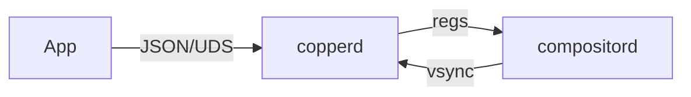

# docs

**Authoritative specifications, architecture notes, and guides for CopperlineOS.**  
This repository holds the living documentation for the Phase‑0 Linux‑hosted stack (and seeds for later phases). It is the canonical source for protocols, APIs, timelines, and contributor guides. The public website mirrors content from here.

> TL;DR: If it defines how CopperlineOS works or how to build against it, it belongs here.

---

## Scope

- **Specs** – the precise behavior of services and protocols (stable, testable).  
- **APIs** – service commands/events, field types, error codes, examples.  
- **Architecture** – system diagrams, frame timing, scheduling, security.  
- **Guides** – getting started, dev setup, debugging checklists.  
- **Design notes** – decisions, trade‑offs, future directions (clearly marked).

---

## Layout

```
docs/
├─ specs/
│  ├─ copper-minspec.md          # Copper program: ops, timing, validation
│  ├─ ports-protocol-v0.md       # Ports JSON/NDJSON protocol (v0)
│  ├─ blitter-ops-v0.md          # Rect fill/copy/convert semantics
│  └─ audio-graph-v0.md          # Node types, periods, XRUN semantics
├─ apis/
│  ├─ compositord-api.md         # Layers, registers, events, DMABUF binding
│  ├─ copperd-api.md             # Program load/start/stop, events, fences
│  ├─ blitterd-api.md            # Job model, surfaces, batches
│  └─ audiomixerd-api.md         # Control commands, nodes, connect, stats
├─ architecture/
│  ├─ phase0-architecture.md     # Services on Linux, data paths & clocks
│  ├─ frame-timing.md            # Vsync cadence, latching, latency budget
│  └─ security-model.md          # Caps, quotas, process boundaries
├─ guides/
│  ├─ getting-started.md         # First run of services + demos
│  ├─ dev-setup.md               # Toolchains, permissions, seatd/logind
│  ├─ dmabuf-primer.md           # Formats, strides, modifiers, validation
│  └─ debugging.md               # Common failure modes & fixes
├─ design-notes/
│  ├─ decisions/                 # ADR-style decisions with status
│  └─ proposals/                 # Early ideas before formal RFCs
├─ media/                        # Images used by docs (diagrams, screenshots)
└─ README.md                     # You are here
```

**Related repos**  
- [`website`](https://github.com/CopperlineOS/website) – publishes the docs site from this content.  
- [`rfcs`](https://github.com/CopperlineOS/rfcs) – formal proposals for breaking/major changes.

---

## Quick links

- **Copper minspec** → `specs/copper-minspec.md`  
- **Ports protocol v0** → `specs/ports-protocol-v0.md`  
- **Compositor API** → `apis/compositord-api.md`  
- **Audio graph v0** → `specs/audio-graph-v0.md`  
- **Phase‑0 architecture** → `architecture/phase0-architecture.md`  
- **Getting started** → `guides/getting-started.md`

*(If a link 404s, that doc is queued in the roadmap below.)*

---

## Conventions

### Diagrams

- Prefer **Mermaid** in Markdown; rendered on GitHub and the website.
- Keep diagrams small and focused; avoid tool‑specific styling.

Example:



### Terminology

- **MUST/SHOULD/MAY** follow RFC 2119 meanings.  
- **Time units**: use **microseconds (`usec`)** for timestamps; **ms** for durations in prose.  
- **Coordinates**: top‑left origin, integer pixels unless noted.

### File headers

Every spec/API doc begins with a header block:

```text
Status: Draft | Stable | Deprecated
Protocol: ports/v0
Last‑Updated: 2025‑08‑23
```

---

## Versioning & stability

- **Protocols** carry an explicit version (e.g., `ports protocol 0`). Breaking changes require an RFC and a new protocol version.  
- **APIs** include **error code tables** and **examples** that are tested in CI against service mocks.  
- **Specs** move Draft → Stable when the implementation and tests land.

---

## How the website uses these docs

The `website` repo pulls from this tree in CI. To contribute docs you **only** need to edit Markdown here; the website will update automatically after merge. Keep image assets in `media/` and reference them with relative paths.

---

## Contributing

1. Open an issue describing gaps or changes.  
2. For substantive changes, consider an RFC in `CopperlineOS/rfcs` and link it in the doc header.  
3. Keep examples **copy‑paste runnable** with the Phase‑0 tools (`portctl`, `timeline-inspect`).  
4. Add or update diagrams; prefer Mermaid.  
5. Run prose/style checks (optional) and ensure links resolve.

Style guidance lives in `guides/writing-style.md` and `guides/diagram-style.md` (to be added).

---

## Roadmap for docs

- [ ] `specs/copper-minspec.md` (ops, validation, examples)  
- [ ] `specs/ports-protocol-v0.md` (framing, requests, events, FDs, errors)  
- [ ] `apis/compositord-api.md` (register set, commit model, events)  
- [ ] `apis/copperd-api.md` (program lifecycle, subscriptions)  
- [ ] `specs/blitter-ops-v0.md` (rect ops, convert, batches)  
- [ ] `architecture/frame-timing.md` (latency budgets, measurement)  
- [ ] `guides/dmabuf-primer.md` (formats/stride/modifiers)  
- [ ] `architecture/security-model.md` (caps, quotas, sandboxing)

---

## License

Documentation is licensed under **Apache‑2.0 OR MIT**. Code snippets are under the same terms unless stated otherwise.

---

## See also

- [`copperd`](https://github.com/CopperlineOS/copperd) · [`compositord`](https://github.com/CopperlineOS/compositord) · [`blitterd`](https://github.com/CopperlineOS/blitterd) · [`audiomixerd`](https://github.com/CopperlineOS/audiomixerd)  
- [`ports`](https://github.com/CopperlineOS/ports) · [`sdk-rs`](https://github.com/CopperlineOS/sdk-rs) · [`sdk-c`](https://github.com/CopperlineOS/sdk-c)
